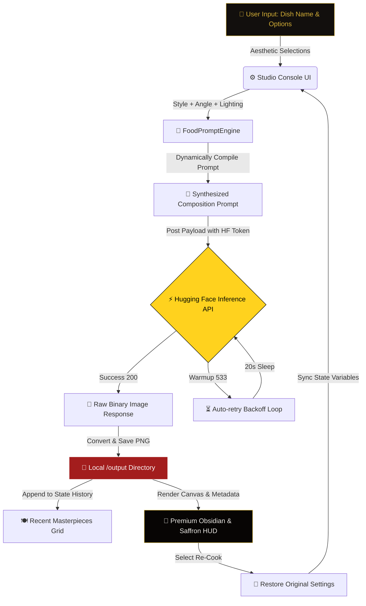

<div align="center">

# 👨‍🍳 DigitalChef AI — Fine Art AI Food Photography Studio

### 🍽️ **Visual Plating & Menu Synthesis for the Restaurant 3.1 Era**

[](https://git.io/typing-svg)


<br/>

### **Where Culinary Arts Meet Generative AI.**
### **Transform raw dish concepts into high-resolution, styled food photography in seconds. Designed for menus, social media, and digital branding.** 📸✨

</div>

---

## 🍕 **RESTAURANT 3.1: THE DIGITAL CULINARY REVOLUTION**

In the **Restaurant 3.1** ecosystem, menus are no longer static text on paper. Modern food brands require dynamic visual asset pipelines to validate new recipes, design promotional material, manage virtual brands (ghost kitchens), and run real-time social media marketing. 

**DigitalChef AI** solves the massive costs, ingredient waste, and scheduling delays of physical food photography. By integrating advanced prompt engineering with state-of-the-art latent diffusion models, it enables chefs, restaurateurs, and culinary marketers to render hyper-realistic food images tailored to specific visual aesthetics.

---

## 🎨 **STUDIO CONFIGURATION & STYLING MATRIX**

DigitalChef AI leverages a curated selection of culinary aesthetics, camera angles, and professional lighting configurations to generate the perfect plating shot:

| Photography Style | Default Surfaces | Lighting Presets | Compositional Props & Extras |
| :--- | :--- | :--- | :--- |
| **Rustic** 🪵 | Dark weathered oak table, reclaimed barn wood, textured linen | Warm afternoon sunlight, soft window light, golden hour glow | Scattered fresh herbs, bread crumbs, cast iron accents |
| **Fine Dining** 💎 | Polished white marble, sleek black slate, luxury white tablecloth | Dramatic spotlighting, soft key light with shadow fill | Microgreens garnish, delicate sauce drizzle, silver cutlery |
| **Modern** 🧱 | Matte concrete, brushed copper, contemporary ceramic tile | Bright clean studio lighting, volumetric side window light | Geometric shadows, high-contrast plates, sleek glassware |
| **Street Food** 🍢 | Crumpled parchment paper, street vendor cart, metal dining tray | Vibrant neon glow, harsh overhead sun, streetlamp glow | Steam rising, sauce drips, hands holding the dish |
| **Moody** 🍷 | Dark charcoal stone, black charred wood, dark velvet cloth | Low-key chiaroscuro lighting, dramatic high-contrast rim light | Drifting smoke, reflective olive oil drops, dark ingredients |

---

## ⚡ **SYSTEM ARCHITECTURE FLOW**

The diagram below outlines how the Streamlit interface, `FoodPromptEngine`, and FLUX-schnell model collaborate to generate high-resolution masterpieces:



---

## 🔬 **PROMPT ENGINEERING SPOTLIGHT**

Under the hood, the [FoodPromptEngine](file:///c:/my_local_data(one%20drive)/Attachments/Ambition%20course/my_all_projects/project%2069%20DigitalChef_AI/core/prompt_gen.py#L3) converts simple, brief dish names into highly descriptive, industry-compliant studio prompts. 

For instance, if a chef selects a **"Fine Dining"** style with **"Auto-Detect"** lighting and **"45-degree angle hero shot"** for the dish **"Truffle Mushroom Risotto"**, the engine performs the following composition expansion:

```python
# dynamic prompt construction structure
prompt = (
    f"Award-winning professional food photography of {dish_name}, {angle}, "
    f"placed on {surface}, under {light}, {extra}. "
    f"Shot on 85mm lens, f/1.8 aperture, highly detailed texture, "
    f"commercial quality, ultra-realistic, 8k resolution."
)
```

#### **The Generated Ingredient:**
> *"Award-winning professional food photography of Truffle Mushroom Risotto, 45-degree angle hero shot, placed on sleek black slate plate, under dramatic studio spotlighting, delicate sauce drizzle. Shot on 85mm lens, f/1.8 aperture, highly detailed texture, commercial quality, ultra-realistic, 8k resolution."*

---

## 🛠️ **TECHNOLOGY STACK**

```
 🖥️ Interface  --->   Streamlit (Glassmorphic Saffron HUD)
 🧠 Engine     --->   Python 3.9+ / Pillow (PIL)
 🧬 Model      --->   FLUX.1-schnell (via Hugging Face API)
 💾 Storage    --->   Local Disk (/output)
```

- **Streamlit**: Renders the high-end dashboard featuring custom styling, responsive dials, background floating food emojis, and gallery cards.
- **Hugging Face Inference API**: Hosts the `black-forest-labs/FLUX.1-schnell` model, generating ultra-realistic food renders in under 5 seconds.
- [Pillow](file:///c:/my_local_data(one%20drive)/Attachments/Ambition%20course/my_all_projects/project%2069%20DigitalChef_AI/requirements.txt): Manages image parsing, formatting, and saving pipelines.
- **Python-dotenv**: Handles HF Bearer Tokens securely.

---

## 📂 **PROJECT BLUEPRINT**

```text
DigitalChef_AI/
│
├── 📂 core/                         # Culinary Core Engine
│   ├── 📜 model_loader.py           # FLUX.1 API connection & retry policies
│   └── 📜 prompt_gen.py             # Prompt builder with photography style presets
│
├── 📂 output/                       # Local database of generated dishes
│   └── 🖼️ dish_1782650733.png       # Timestamped PNG masterpieces
│
├── 📂 assets/                       # Static branding & assets
│
├── 📜 app.py                        # Streamlit obsidian-saffron UI controller
├── 📜 .env                          # Local credentials (ignored)
├── 📜 .env.example                  # Environment template
├── 📜 requirements.txt              # Project packages
└── 📖 README.md                     # Studio Documentation (You are here!)
```

*File Navigation Links:*
- Core Logic Loader: [model_loader.py](file:///c:/my_local_data(one%20drive)/Attachments/Ambition%20course/my_all_projects/project%2069%20DigitalChef_AI/core/model_loader.py) containing class [FoodImageGenerator](file:///c:/my_local_data(one%20drive)/Attachments/Ambition%20course/my_all_projects/project%2069%20DigitalChef_AI/core/model_loader.py#L11).
- Dynamic Prompt Engine: [prompt_gen.py](file:///c:/my_local_data(one%20drive)/Attachments/Ambition%20course/my_all_projects/project%2069%20DigitalChef_AI/core/prompt_gen.py) containing class [FoodPromptEngine](file:///c:/my_local_data(one%20drive)/Attachments/Ambition%20course/my_all_projects/project%2069%20DigitalChef_AI/core/prompt_gen.py#L3).
- Interface Entry point: [app.py](file:///c:/my_local_data(one%20drive)/Attachments/Ambition%20course/my_all_projects/project%2069%20DigitalChef_AI/app.py).
- Dependencies: [requirements.txt](file:///c:/my_local_data(one%20drive)/Attachments/Ambition%20course/my_all_projects/project%2069%20DigitalChef_AI/requirements.txt).
- Configurations Template: [.env.example](file:///c:/my_local_data(one%20drive)/Attachments/Ambition%20course/my_all_projects/project%2069%20DigitalChef_AI/.env.example).

---

## 🚀 **GETTING STARTED & LAUNCH GUIDE**

Follow these quick steps to set up the DigitalChef AI Studio on your local machine:

### **1. Clone the Project & Enter Directory**
Open your terminal and navigate to the project root:
```powershell
cd "project 69 DigitalChef_AI"
```

### **2. Install Dependencies**
Install all required libraries using pip:
```powershell
pip install -r requirements.txt
```

### **3. Set Up API Credentials**
1. Get a free Hugging Face API Token with write/read privileges from [Hugging Face Settings](https://huggingface.co/settings/tokens).
2. Create a `.env` file in the root folder:
   ```env
   HF_TOKEN=your_hugging_face_token_here
   ```

### **4. Launch the AI Food Studio**
Run the Streamlit application:
```powershell
streamlit run app.py
```
Open your browser and navigate to:
👉 **`http://localhost:8501`**

---

## 👨‍🍳 **CONNECT WITH THE CHEF**

<div align="center">

[](https://github.com/mayank-goyal09)
[](https://www.linkedin.com/in/mayank-goyal-4b8756363/)
[](https://mayank-goyal09.github.io/)

**Mayank Goyal**  
🧠 GenAI & Prompt Engineer | 🍔 Culinary Asset Architect | 🤖 Automation Developer

</div>

---

<div align="center">

### **Crafted with ❤️ by Mayank Goyal**
*"Generate the aesthetic. Cook the future."* 🍽️⚡💻


</div>
